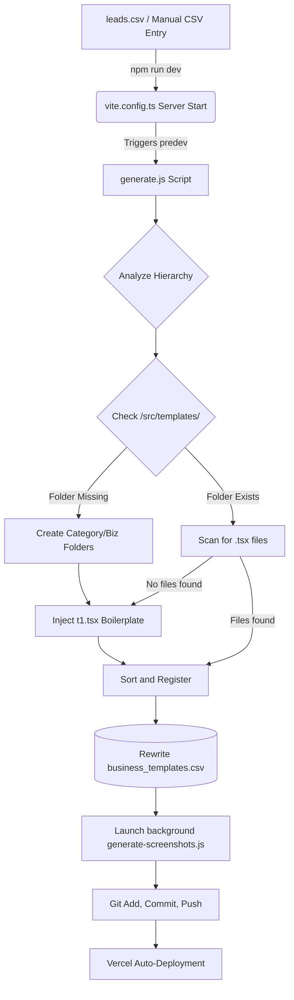
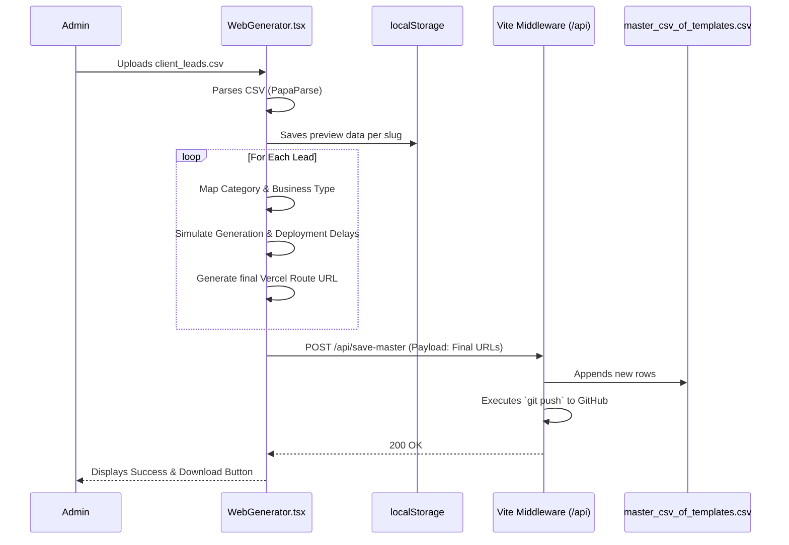
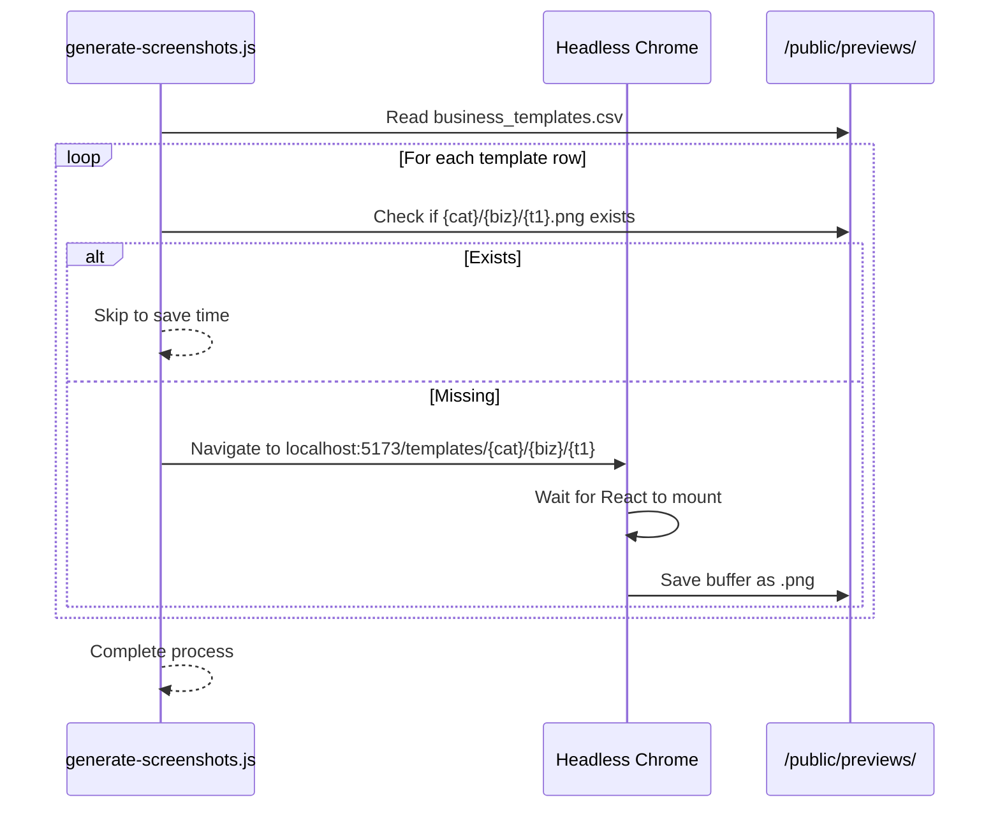

# ShowcasePro System Architecture & Detailed Workflows

This document is the definitive technical blueprint of the **ShowcasePro** platform. It covers the exact folder structures, file-by-file logic, data schemas, routing architectures, and automated backend scripts that power the system.

---

## 1. System Overview & Technology Stack

**ShowcasePro** is a Next-Gen Automated Website Generation Platform built to parse CSV files containing business leads and instantly generate, deploy, and showcase React-based website templates for each lead.

### Core Stack
*   **Frontend**: React 18, React Router v6, TailwindCSS, Framer Motion, Lucide Icons.
*   **Build Tool / Local Server**: Vite (with custom Node.js middleware plugins for filesystem access).
*   **Automation Engine**: Node.js scripts (`fs`, `child_process`) combined with Puppeteer (for headless browser screenshots).
*   **Database / Storage**: Local file system (CSV files and JSON).
*   **Deployment**: Vercel (triggered via automated GitHub pushes from the local Vite server).

---

## 2. Exhaustive Directory & File Dictionary

### 📁 Root Configuration & Automation Scripts
These files sit at the base of the project and control the environment, build lifecycle, and the heavy-lifting automation.

*   **`package.json`**: Defines dependencies and crucial npm scripts:
    *   `"predev": "node generate.js"` - Ensures templates exist before starting Vite.
    *   `"add": "node generate.js && node generate-screenshots.js && git add ... && git push"` - The master sync command.
*   **`vite.config.ts`**: Not just a bundler config. It acts as a lightweight backend during development. It includes custom Vite plugins:
    *   `auto-run-add-on-start`: Spawns `npm run add` automatically in the background when the dev server starts.
    *   `master-csv-writer`: Intercepts API calls (`/api/sync-business-templates`, `/api/save-master`, `/api/download-master`) to write data directly to the local filesystem and execute Git commands.
*   **`generate.js`**: The heart of the platform.
    *   Reads `leads_20260611_134521.csv` and `data csv/business_templates.csv`.
    *   Analyzes the hierarchy (Category -> Business Type).
    *   Creates missing directories in `src/templates/`.
    *   Injects a default `t1.tsx` boilerplate if a folder is empty.
    *   Updates `business_templates.csv` with the final file paths.
*   **`generate-screenshots.js`**: An automation script using Puppeteer. It reads the CSV, opens a headless browser to `localhost:5173/templates/preview/...`, takes a screenshot, and saves it to `/public/previews/`.
*   **`auto-screenshot.js`**: A secondary variant of the screenshot script.
*   **`push-registry.js`**: A script to force a registry push to GitHub.
*   **`clean-folders.js` & `clean-csv.js`**: Maintenance scripts used to sanitize the CSV and remove orphaned template folders if a business type is deleted.

### 📁 `/api` (Vercel Serverless Functions)
When deployed to Vercel (where `vite.config.ts` middleware doesn't run), these files handle API requests.
*   **`api/download-master.js`**: Allows the admin to download the `master_csv_of_templates.csv` file from the Vercel deployment.
*   **`api/save-master.js`**: Receives an array of successfully deployed websites and appends them to `master_csv_of_templates.csv` using the GitHub API to update the file in the repository.

### 📁 `/data` & `/data csv` (Storage Layer)
*   **`data csv/business_templates.csv`**: The **Single Source of Truth** for the application's UI. It maps: `id, category, business_type, template_name, template_path, template_code`.
*   **`data/master_csv_of_templates.csv`**: The output record. It tracks the final deployed Vercel URLs for the generated client websites (`business_name, category, template_code, slug, url, date_generated`).
*   **`src/data/users.json`**: The authentication database. Contains user credentials, roles (`admin` vs `client`), and for clients, their restricted `category` and `businessType`.

### 📁 `/src` (Application Source Code)
The frontend React application.

*   **`src/App.tsx`**: The core router. Defines the application routes:
    *   `/` -> `Landing.tsx`
    *   `/login` -> `Login.tsx`
    *   `/showcase` -> `Showcase.tsx` (Protected)
    *   `/b2b` -> `B2BHub.tsx` (Protected Admin Dashboard)
    *   `/b2b/webgene` -> `WebGenerator.tsx` (Protected Admin tool)
    *   `/templates/:category/:business/:template/:slug` -> `TemplateViewer.tsx` (The dynamic template rendering route)
*   **`src/main.tsx`**: React DOM entry point.
*   **`src/index.css`**: Global styles and Tailwind directives.

### 📁 `/src/pages` (Main Views)
*   **`Landing.tsx`**: The marketing homepage ("TinitiateAI Ecosystem") featuring animations, feature breakdowns, and pricing.
*   **`Login.tsx`**: Authentication screen. Validates against `src/data/users.json`.
*   **`B2BHub.tsx`**: A simple routing dashboard for Admins to choose between the Showcase or the WebGenerator tool.
*   **`WebGenerator.tsx`**: The core administrative interface.
    *   Allows uploading a CSV of leads.
    *   Parses the CSV in the browser.
    *   Simulates generation, then calls `/api/save-master` to write the final URLs.
*   **`Showcase.tsx`**: The premium gallery.
    *   Reads `business_templates.csv` using a raw Vite import.
    *   Builds a dynamic sidebar of Categories and Business Types.
    *   Displays screenshot cards for every template.
    *   If a `client` logs in, this page strictly filters the list to show *only* their assigned category.
*   **`TemplateViewer.tsx`**: The wrapper that dynamically imports the actual template code.
    *   Uses `React.lazy()` to dynamically `import(src/templates/${category}/${business}/${actualTemplateFile}.tsx)`.
    *   Reads fallback data from `localStorage` (saved by WebGenerator) to populate the template with real business names and data.

### 📁 `/src/components` (UI Elements)
*   **`Layout.tsx`**: Provides the Navigation Bar (with Auth context) and Footer.
*   **`/b2b/CsvUploader.tsx`**: Drag-and-drop zone for PapaParse CSV ingestion.
*   **`/b2b/ResultsTable.tsx` & `ProgressCards.tsx`**: Visual feedback for the WebGenerator pipeline.

### 📁 `/src/utils` (Helpers)
*   **`parseCSV.ts`**: Browser-side PapaParse implementation.
*   **`slugify.ts`**: Converts "Law Firm" to "law-firm".
*   **`templateMapper.ts`**: Associates incoming CSV categories to the known template structures.

### 📁 `/src/templates` (The Generated Output)
*   **`src/templates/[industry]/[business-type]/[t1...tn].tsx`**: The dynamically generated files. This folder structure is built on the fly by `generate.js`.

---

## 3. Core Automation Workflows & Diagrams

### A. The End-to-End Generation Pipeline (CLI & Backend)
How data moves from a raw CSV to a functional React codebase.



### B. The WebGenerator UI Flow (Frontend)
How the Admin uses the UI to upload leads and get deployed URLs.



### C. The Dynamic Template Rendering Flow
How `TemplateViewer.tsx` dynamically loads a template when a user clicks a link like `localhost:5173/templates/retail/jewellery-store/t1/smith-jewelers`.

```mermaid
graph LR
    URL[URL Parameters] --> A[TemplateViewer.tsx]
    
    A -->|Extract| B(Category: retail)
    A -->|Extract| C(Business: jewellery-store)
    A -->|Extract| D(Template: t1)
    A -->|Extract| E(Slug: smith-jewelers)
    
    E --> F{Check localStorage for 'preview_smith-jewelers'}
    F -->|Found Data| G[Merge with Fallback Data]
    F -->|Not Found| H[Use Default Fallback Data]
    
    B & C & D --> I[React.lazy Dynamic Import]
    I --> J[import('/src/templates/retail/jewellery-store/t1.tsx')]
    
    G --> K[Render T1 Component]
    H --> K
    J --> K
    
    K --> Output((Browser Screen))
```

### D. The Automated Screenshot Pipeline
Ensures every template has a thumbnail in the Showcase.



---

## 4. Summary of Architectural Decisions

1. **CSV as a Database**: Instead of a traditional SQL/NoSQL database, the platform relies entirely on `business_templates.csv`. This ensures the codebase is portable, instantly editable via Excel, and completely decoupled from complex database migrations.
2. **Dynamic React Imports**: `React.lazy()` is heavily utilized in `TemplateViewer.tsx` so the platform doesn't need to bundle thousands of templates into a single JS file. Code is only loaded when a specific URL is visited.
3. **Vite as a Backend**: By extending `vite.config.ts` with custom middleware and Node `child_process` hooks, the local development environment acts as an orchestration server that writes files and triggers Git actions automatically.
