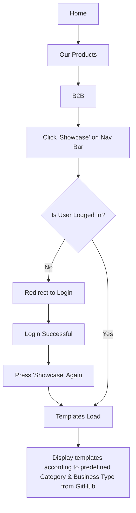
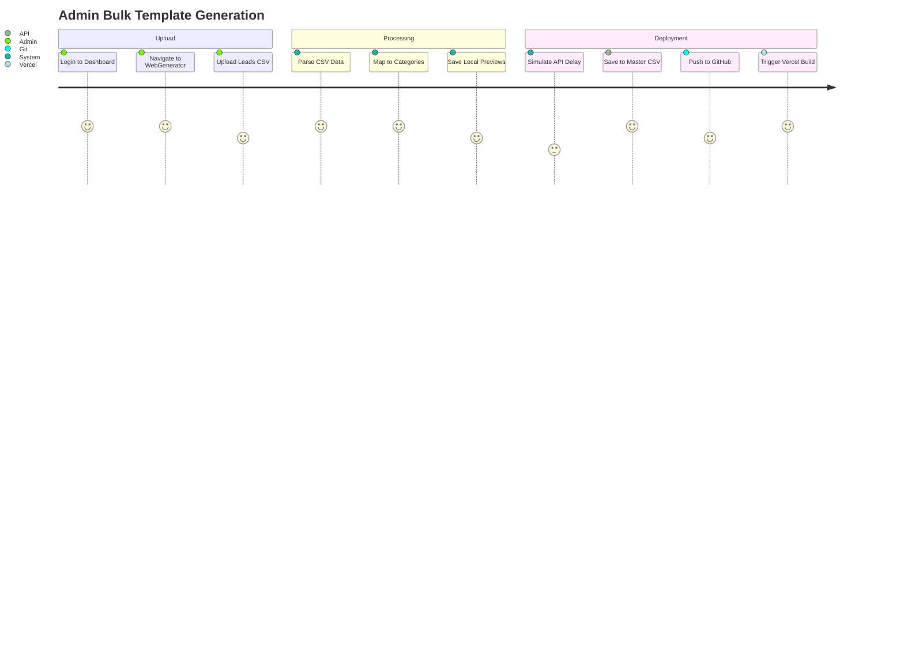
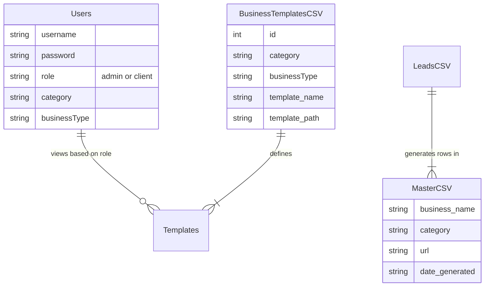
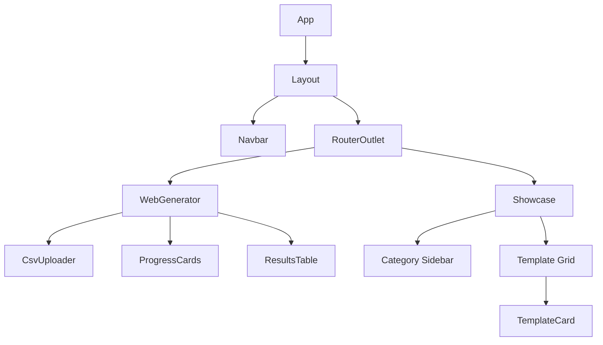
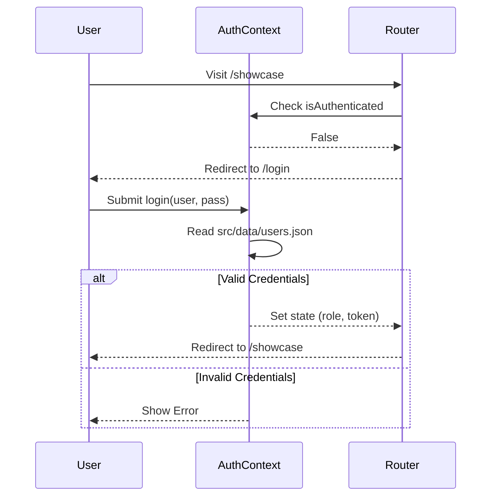
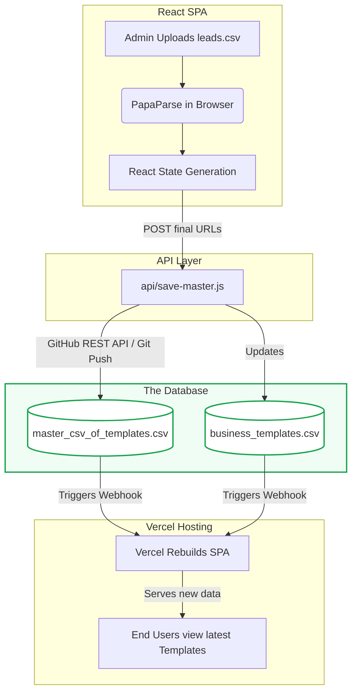
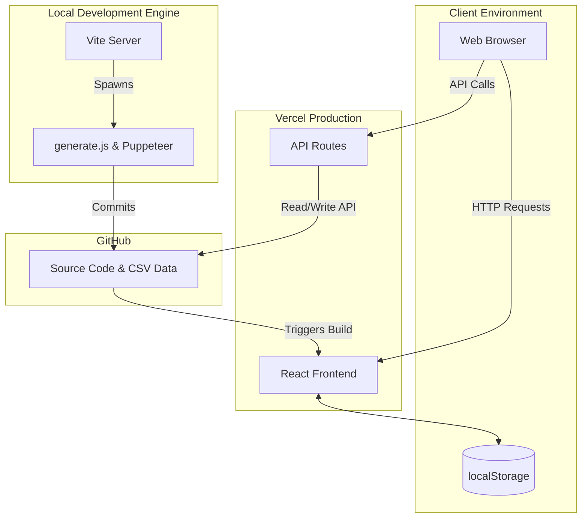

# ShowcasePro System Architecture & Technical Blueprint

This document is a comprehensive, enterprise-level guide to the **ShowcasePro** system architecture, built to parse CSV files containing business leads and instantly generate, deploy, and showcase React-based website templates for each lead. 

---

## 1. Project Overview

*   **Project Name**: ShowcasePro (TinitiateAI Ecosystem Platform)
*   **Purpose of the application**: An automated website generation and showcasing platform for bulk business leads. 
*   **Problem it solves**: Replaces manual creation and deployment of demo sites for B2B leads. Instead of creating templates manually, admins can upload a CSV, and the system provisions folders, injects templates, takes headless browser screenshots, registers the URLs, and deploys them to Vercel automatically.
*   **Target users**: Internal sales/marketing teams (Admins) and B2B clients viewing their generated sites.
*   **Main features**:
    *   Drag-and-drop CSV upload and parsing in the browser.
    *   Automated React codebase generation via backend Node scripts.
    *   Headless template screenshot generation using Puppeteer.
    *   Role-based client/admin Showcase portal for previewing live links.
    *   Automated Vercel deployment syncing via Git.
*   **Overall workflow**: Leads uploaded via UI -> Parsed & mapped -> Local API invoked -> Background script creates files & commits to Git -> Vercel builds -> Screenshots captured -> Master CSV updated.
*   **High-level summary**: A unique hybrid application where Vite acts as a local file-system orchestrator and API server, generating static React assets that are subsequently deployed as a serverless Single Page Application (SPA).

---

## 2. Tech Stack

### Frontend
*   **React (v18)**: Core UI framework.
*   **Vite**: Extremely fast frontend build tool, extended with custom plugins to act as a local API and file-system runner.
*   **TypeScript**: Ensures type safety across the frontend.
*   **Tailwind CSS**: Utility-first CSS framework for rapid, highly aesthetic UI styling.
*   **Framer Motion**: Used for fluid page transitions, mounting animations, and dynamic interactions.
*   **Lucide React**: Consistent SVG icon library.
*   **React Router v6**: Client-side routing.

### Backend / Automation (Node.js)
*   **Node.js**: Powers custom automation scripts (`generate.js`, `clean-folders.js`, `generate-screenshots.js`) that manipulate the file system.
*   **Puppeteer**: Headless Chrome browser automation used to take dynamic screenshots of generated templates for the Showcase UI.
*   **Child Process API**: Executes raw `git` and `npm` commands directly from within Vite to automate deployments.

### API & Serverless
*   **Vercel Serverless Functions**: The `api/` directory endpoints (`save-master`, `download-master`) act as backend handlers in the cloud environment, reading/writing to the data files on GitHub.

### Storage / Database
*   **CSV & JSON Filesystem Storage**: The platform intentionally avoids traditional databases. `data csv/business_templates.csv` is the Single Source of Truth for the UI. `src/data/users.json` handles mock authentication. `master_csv_of_templates.csv` records all deployment URLs.

### Deployment
*   **Vercel**: Hosts the frontend application and the serverless `/api` routes. Triggered automatically on GitHub pushes.
*   **GitHub**: Acts as the deployment pipeline mediator.

---

## 3. Libraries Used

| Library                | Purpose                         | Used In                     |
| ---------------------- | ------------------------------- | --------------------------- |
| `react` / `react-dom`  | Core UI framework               | Entire Frontend             |
| `vite`                 | Build Tool / Local Server       | Development & Build process |
| `react-router-dom`     | Application Routing             | `App.tsx`                   |
| `tailwindcss`          | UI Styling                      | All Components              |
| `framer-motion`        | UI Animations & Transitions     | Showcase, WebGenerator      |
| `lucide-react`         | Icons                           | Navigation, Cards           |
| `papaparse`            | Browser-side CSV Parsing        | `WebGenerator.tsx`          |
| `puppeteer`            | Headless browser screenshots    | `generate-screenshots.js`   |
| `clsx` / `tailwind-merge`| Dynamic class management      | UI Components               |
| `react-hook-form`      | Form Handling                   | Authentication forms        |
| `zod`                  | Schema Validation               | Data parsing validation     |

---

## 4. Environment Variables

*   **`VITE_VERCEL_URL`**
    *   **Purpose**: Stores the production URL of the deployed application.
    *   **Where it is used**: `WebGenerator.tsx`
    *   **Importance**: Used to construct absolute URLs when generating the final master CSV records (e.g., `https://showcasepro.vercel.app/templates/...`) rather than saving `localhost` links.

---

## 5. Folder Structure

```
showcasepro/
├── api/
├── data/
├── data csv/
├── public/
│   ├── previews/
│   └── templates/
├── src/
│   ├── admin/
│   ├── components/
│   │   └── b2b/
│   ├── context/
│   ├── data/
│   ├── pages/
│   ├── templates/
│   ├── types/
│   └── utils/
├── .env
├── package.json
├── vite.config.ts
├── tailwind.config.js
├── generate.js
├── generate-screenshots.js
└── ARCHITECTURE.md
```

---

## 6. Folder-by-Folder Explanation

### `api/`
**Purpose**: Vercel Serverless Functions. Handles backend API logic that must run in the production environment where Vite middleware is absent.

### `data/` and `data csv/`
**Purpose**: The filesystem-based database layer. Holds `business_templates.csv` (the registry of all templates) and `master_csv_of_templates.csv` (the output log of generated client URLs).

### `public/`
**Purpose**: Static asset serving. Contains global images, auto-generated screenshot thumbnails (`public/previews/`), and direct HTML templates (`public/templates/`) that bypass the Vite bundler.

### `src/components/`
**Purpose**: Reusable UI components. `Layout.tsx` handles global navigation. `src/components/b2b/` contains specialized, modular components for the Admin CSV upload flow.

### `src/context/`
**Purpose**: React Context Providers. Holds global application state, primarily user authentication (`AuthContext.tsx`).

### `src/pages/`
**Purpose**: Full-page route views. Each file maps to a specific URL route (e.g., `Showcase.tsx`, `WebGenerator.tsx`, `Landing.tsx`).

### `src/templates/`
**Purpose**: The dynamic output directory. This is where `generate.js` creates nested folders (`[category]/[business-type]/t1.tsx`) containing the generated website React code.

### `src/utils/`
**Purpose**: Helper functions decoupled from React components. Includes CSV parsing wrappers (`parseCSV.ts`), string manipulation (`slugify.ts`), and registry mapping (`templateMapper.ts`).

---

## 7. File-by-File Explanation

### Root Configuration & Automation

#### `generate.js`
*   **Location**: `/generate.js`
*   **Purpose**: The central automation engine of the platform.
*   **Responsibilities**: Reads leads CSV, creates dynamic category/business folder hierarchies in `src/templates`, injects boilerplate `.tsx` files if they don't exist, and maps Next.js legacy templates to React.
*   **Used By**: `npm run predev`, `npm run add`, Vite build hooks.
*   **Dependencies**: `fs`, `path`.

#### `generate-screenshots.js`
*   **Location**: `/generate-screenshots.js`
*   **Purpose**: Automated thumbnail generation.
*   **Responsibilities**: Reads the registry, boots up a headless Chrome instance via Puppeteer, navigates to every local template route, and takes a snapshot to save in `public/previews`.
*   **Used By**: `npm run add`.
*   **Dependencies**: `puppeteer`, `fs`.

#### `vite.config.ts`
*   **Location**: `/vite.config.ts`
*   **Purpose**: Development server and bundler configuration.
*   **Responsibilities**: Extends standard Vite behavior with custom middleware that intercepts `/api/save-master` API requests locally to write to the filesystem and execute `git` child processes.
*   **Used By**: Local dev server, build pipeline.

#### `package.json`
*   **Location**: `/package.json`
*   **Purpose**: Project metadata and dependency management.
*   **Responsibilities**: Defines the complex `sync` and `add` NPM scripts that chain the Node generators and Git commands.

### API Routes

#### `api/save-master.js`
*   **Location**: `/api/save-master.js`
*   **Purpose**: Receives generated template URLs from the frontend and appends them to the persistent storage.
*   **Responsibilities**: Deduplicate URLs, append to `master_csv_of_templates.csv`, and interact with the GitHub API to push updates from the Vercel serverless environment.

#### `api/download-master.js`
*   **Location**: `/api/download-master.js`
*   **Purpose**: Allows admins to securely download the master CSV file.
*   **Responsibilities**: Reads the file from disk/repository and pipes it to the HTTP response with `text/csv` headers.

### React Core

#### `src/App.tsx`
*   **Location**: `/src/App.tsx`
*   **Purpose**: The core application router.
*   **Responsibilities**: Defines all `react-router-dom` paths, wrapping secure routes in a `<ProtectedRoute>` component that checks `useAuth()`.
*   **Dependencies**: `react-router-dom`, `AuthContext`.

#### `src/main.tsx`
*   **Location**: `/src/main.tsx`
*   **Purpose**: React DOM mounting point.

### React Pages

#### `src/pages/WebGenerator.tsx`
*   **Location**: `/src/pages/WebGenerator.tsx`
*   **Purpose**: The B2B Admin interface for bulk generation.
*   **Responsibilities**: Handles drag-and-drop CSV uploads, parses data using PapaParse, simulates a processing pipeline (Generating -> Deploying -> Success) for visual feedback, saves placeholder data to `localStorage` for dynamic previewing, and calls `/api/save-master`.
*   **Components Used**: `CsvUploader`, `ProgressCards`, `ResultsTable`.

#### `src/pages/Showcase.tsx`
*   **Location**: `/src/pages/Showcase.tsx`
*   **Purpose**: The gallery where users view available templates.
*   **Responsibilities**: Reads raw CSV data via Vite's `?raw` import. Builds a dynamic sidebar of categories and business types. Filters the view based on the user's role (Client vs Admin). Polls the CSV in the background to dynamically update when Vercel finishes a new deployment.
*   **Dependencies**: `framer-motion`, `lucide-react`.

#### `src/pages/TemplateViewer.tsx`
*   **Location**: `/src/pages/TemplateViewer.tsx`
*   **Purpose**: The dynamic React rendering engine for templates.
*   **Responsibilities**: Captures URL params (`:category/:business/:template/:slug`). Fetches simulated client data from `localStorage`. Uses `React.lazy()` to dynamically import the specific template file (e.g. `import('../templates/retail/jewellery-store/t1.tsx')`).

### React Components

#### `src/components/b2b/CsvUploader.tsx`
*   **Purpose**: UI drag-and-drop zone.
*   **Responsibilities**: Validates file types and sizes before passing the File object up to the `WebGenerator`.

#### `src/context/AuthContext.tsx`
*   **Purpose**: State management for user sessions.
*   **Responsibilities**: Reads from `src/data/users.json` to validate credentials. Provides `login()`, `logout()`, and exposes the current `user` object to the entire component tree.

---

## 8. UI Flow

### Application UI Flow



---

## 9. Complete Navigation Flow

| Path | Component | Purpose | Permissions | APIs Used |
| :--- | :--- | :--- | :--- | :--- |
| `/` | `Landing.tsx` | Marketing homepage | Public | None |
| `/login` | `Login.tsx` | Authentication | Public | Local JSON read |
| `/b2b` | `B2BHub.tsx` | Admin navigation hub | Admin Only | None |
| `/b2b/webgene` | `WebGenerator.tsx` | CSV Upload & Generation | Admin Only | `/api/save-master`, `/api/download-master` |
| `/showcase` | `Showcase.tsx` | Template gallery | Authenticated | Static file polling |
| `/preview` | `PreviewWrapper.tsx` | Iframe wrapper for demos | Public | None |
| `/templates/...` | `TemplateViewer.tsx`| Dynamic component render | Public | LocalStorage read |

---

## 10. Admin Panel Flow



---

## 11. API Documentation

### `POST /api/sync-business-templates`
*   **Purpose**: Triggers a manual Git push from the UI to synchronize local file changes with Vercel.
*   **Environment**: Intercepted locally by `vite.config.ts` middleware.
*   **Business Logic**: Executes `node generate.js && git add ... && git commit && git push`.
*   **Response**: `{ "success": true }`

### `POST /api/save-master`
*   **Purpose**: Appends successfully generated template URLs to the master tracking file.
*   **Request Body**:
    ```json
    [
      {
        "businessName": "Acme Corp",
        "category": "Retail",
        "template": "t1",
        "slug": "acme-corp",
        "url": "https://showcasepro.vercel.app/templates/..."
      }
    ]
    ```
*   **Business Logic**: Deduplicates URLs. Reads existing CSV, appends new rows with a timestamp, writes to filesystem (or GitHub API in prod).
*   **Response**: `{ "success": true, "newRowsAdded": true }`

### `GET /api/download-master`
*   **Purpose**: Downloads the `master_csv_of_templates.csv` file.
*   **Response**: `text/csv` attachment stream.

---

## 12. Database Flow

The platform relies on a **File-System as a Database** pattern.

### Entities
1.  **Registry (`business_templates.csv`)**: Source of truth for categories, business types, and template file locations.
2.  **Master Log (`master_csv_of_templates.csv`)**: Historical ledger of all generated client URLs.
3.  **Auth Store (`users.json`)**: User credentials and roles.



---

## 13. Component Flow


Props flow downward from `WebGenerator` to `ProgressCards` passing the array of `GeneratedWebsite` objects.

---

## 14. Business Logic Flow

1. **Admin Initiation**: Admin uploads a raw CSV of sales leads into the WebGenerator.
2. **Local Hydration**: The UI parses this and dumps placeholder data (Business Name, Phone, Address) into browser `localStorage` keyed by a generated slug.
3. **API Logging**: The UI posts the final generated URLs to `/api/save-master`.
4. **Backend Sync**: In local dev, Vite intercepts this, writes to disk, and pushes to GitHub.
5. **Vercel Build**: GitHub push triggers Vercel.
6. **Client Review**: A client is given a URL. They click it.
7. **Dynamic Render**: `TemplateViewer.tsx` parses the URL, dynamically imports the raw React component for that business type, injects the `localStorage` data, and renders a fully functional mock website.

---

## 15. Authentication Flow



---

## 16. Data Flow (GitHub as a Database)

The entire application relies on GitHub acting as the persistent database for the frontend. There is no traditional SQL database.



---

## 17. Architecture Diagram



---

## 22. Deployment Architecture

The application is deployed on **Vercel** as a unified full-stack application.
*   **Frontend**: Built via `vite build`, served as a static SPA.
*   **Backend**: The `api/` directory is automatically parsed by Vercel into Serverless Edge Functions (Node.js).
*   **Data Persistence**: Since Vercel serverless functions have ephemeral, read-only file systems, the APIs use the GitHub REST API (or raw data ingestion) to persistently update the master CSV files in the source repository. When GitHub updates, Vercel automatically kicks off a new build to serve the freshest data.

---

## 23. Configuration Files

*   **`vite.config.ts`**: Contains critical middleware. Intercepts `/api` calls during local development to emulate the Vercel serverless functions and directly execute child processes (`git push`). Also automatically triggers `generate.js` on build.
*   **`package.json`**: Contains heavy orchestration scripts. `npm run add` chains file generation, Puppeteer screenshot generation, and Git synchronization into a single command.
*   **`tailwind.config.js`**: Standard utility-class configuration for UI styling.
*   **`tsconfig.json`**: TypeScript compiler rules ensuring strict typing across the React ecosystem.
*   **`vercel.json`**: Optional Vercel overrides, likely configuring routing headers or function regions.

---

## 24. Important Utilities

*   **`slugify.ts`**: Essential for taking raw business names ("Acme Corp & Sons!") and converting them to URL-safe paths (`acme-corp-and-sons`).
*   **`parseCSV.ts`**: A wrapper around PapaParse used in `WebGenerator.tsx` to handle large file uploads without blocking the main thread.
*   **`templateMapper.ts`**: Maps generalized CSV categories (e.g., "Health") to the specific filesystem folder architecture (e.g., `healthcare/dental-clinic`).

---

## 25. Assets

*   **`/public/previews/`**: This directory is highly dynamic. It contains the `.png` thumbnails generated by the Puppeteer script. If a thumbnail is missing, the `Showcase.tsx` component falls back to a live rendering service (Thum.io) or an Unsplash placeholder.
*   **Hero Images**: Various fallback JPGs/PNGs located in `/public` to ensure generated templates always have visual weight even without client data.

---

## 26. Future Improvements

To scale this platform to a higher enterprise tier, the following improvements are recommended:

1.  **Database Migration**: Migrate away from File-System CSV databases to a proper relational database (like Supabase/PostgreSQL). This eliminates the reliance on `git push` for data syncing and solves concurrent write issues.
2.  **Authentication**: Replace local `users.json` with JWT-based authentication (e.g., Supabase Auth or Clerk).
3.  **Blob Storage**: Move `public/previews` to an S3 bucket or Cloudinary. Storing thousands of generated screenshots in Git bloats the repository size exponentially.
4.  **Background Queue**: Move the Puppeteer generation from a local Node script to a dedicated background queue (like BullMQ + Redis or AWS SQS) to handle massive scale.

---

## 28. Final Project Summary

**ShowcasePro** is a highly innovative, bespoke automation platform that bridges the gap between static React architecture and dynamic content generation. 

By leveraging **Vite as an automation engine**, the project successfully bypasses the need for complex database infrastructure, relying entirely on flat files (CSV) and Git version control as its source of truth. The architecture shines in its ability to take a raw list of leads and automatically spit out fully functional, beautifully styled (Tailwind + Framer Motion) React SPAs for every single business. 

It is enterprise-ready for localized marketing teams, but as it scales, migrating to a dedicated database (Supabase) and isolated Object Storage (S3) will be the necessary next steps to ensure maintainability and performance.
