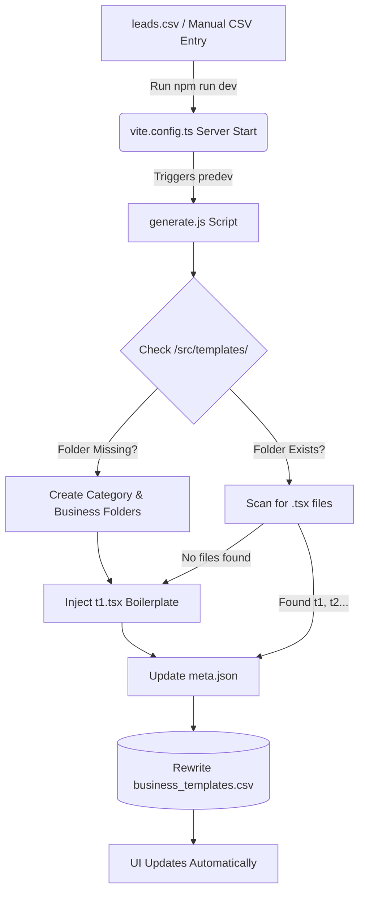
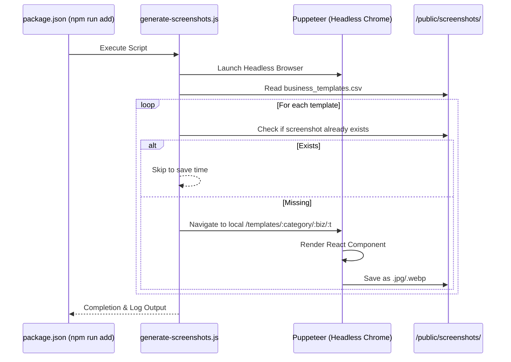
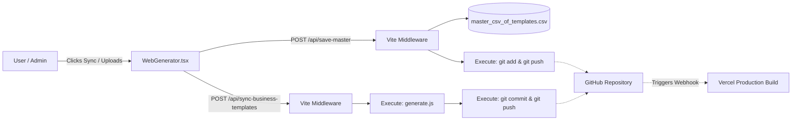

# ShowcasePro System Architecture & Workflows

This document outlines the detailed architecture, directory structures, and automated workflows that power the **ShowcasePro** platform.

---

## 1. Exhaustive File Directory & Roles

### 📁 Root Directory
These files sit at the very base of your project and control the environment, build process, and automation.
*   **`package.json`**: Defines the project dependencies (React, Vite, Puppeteer, Tailwind) and crucial automation scripts (`npm run dev`, `npm run add`, `npm run auto-sync`).
*   **`vite.config.ts`**: The Vite bundler configuration. It does much more than bundle code; it contains custom backend plugins that auto-run generation on startup and intercept `/api/` calls to save files locally.
*   **`generate.js`**: The most critical automation script. It reads the CSVs and dynamically creates new folders and boilerplate React components (`t1.tsx`) in the `/src/templates` directory.
*   **`generate-screenshots.js`**: An automation script that launches a headless Chrome browser (Puppeteer) to take screenshots of every template listed in the CSV and saves them to the public folder.
*   **`auto-screenshot.js`**: A secondary/alternative script for screenshot automation.
*   **`push-registry.js`**: A script designed to force an update/sync of the template registry data.
*   **`clean-folders.js` & `clean-csv.js`**: Maintenance scripts. If you delete a template from the CSV, these scripts can sweep through and delete the orphaned files and folders to keep the project clean.
*   **`leads_20260611_134521.csv`**: The raw source data file containing new business categories and leads that the generator reads from.
*   **`test_leads.csv`, `test2.csv`, `test3.csv`**: Dummy data files used for testing the CSV upload and generation process.

### 📁 `/api` (Serverless Functions)
Files that act as backend endpoints when deployed to Vercel.
*   **`api/download-master.js`**: A serverless function that allows a user to download the live `master_csv_of_templates.csv` file.
*   **`api/save-master.js`**: A serverless function that appends new deployed live URLs to the master CSV.

### 📁 `/data csv` & `/data`
The data storage layer for the application.
*   **`data csv/business_templates.csv`**: The "Single Source of Truth". This CSV maps every category and business type to its exact template file path (`t1.tsx`, etc.). The UI reads this to know what to render.
*   **`data/master_csv_of_templates.csv`**: Tracks the final deployed Vercel URLs for the generated client websites.
*   **`src/data/users.json`**: A JSON database of user credentials, roles, and allowed business types for the authentication system.

### 📁 `/src` (Application Source Code)
The frontend React application.
*   **`src/App.tsx`**: The main React Router setup. It defines which URLs load which Pages (e.g., `/showcase` -> `Showcase.tsx`).
*   **`src/main.tsx`**: The entry point that mounts the React app to the HTML DOM.
*   **`src/index.css`**: Contains global CSS and imports Tailwind CSS utilities.

### 📁 `/src/pages` (Main Application Views)
*   **`src/pages/Landing.tsx`**: The homepage / TinitiateAI Ecosystem view.
*   **`src/pages/Showcase.tsx`**: The premium dashboard where users can browse all available business templates.
*   **`src/pages/TemplateViewer.tsx`**: The UI that wraps and displays a specific generated template when you click on it in the Showcase.
*   **`src/pages/WebGenerator.tsx`**: The admin interface where you can upload a CSV to trigger the bulk website generation process.
*   **`src/pages/B2B.tsx` & `src/pages/B2BHub.tsx`**: Dashboards dedicated to managing B2B clients, uploads, and data parsing.
*   **`src/pages/Login.tsx`**: The authentication screen for clients and admins.

### 📁 `/src/components` (Reusable UI Elements)
*   **`src/components/Layout.tsx`**: The main wrapper component that provides the global Navigation Bar and Footer across all pages.
*   **`src/components/b2b/CsvUploader.tsx`**: The drag-and-drop component for uploading lead CSVs.
*   **`src/components/b2b/ResultsTable.tsx`**: The data table that displays processed leads and generated URLs.
*   **`src/components/b2b/ProgressCards.tsx` & `StatusBadge.tsx`**: UI elements showing the status of bulk generation jobs.

### 📁 `/src/utils` (Helper Functions)
*   **`src/utils/parseCSV.ts`**: Contains the logic to safely read and parse CSV files (using PapaParse) in the browser.
*   **`src/utils/slugify.ts`**: A tiny helper that turns string names like "Law Firm" into URL-safe paths like `"law-firm"`.
*   **`src/utils/templateMapper.ts`**: Contains logic to map a raw business category string to the correct internal folder structure.

### 📁 `/src/templates` (The Generated Code)
*   **`src/templates/[industry]/[business-type]/t1.tsx`**: These are the actual dynamic templates. When `generate.js` runs, it creates these files. If you want to change how the "Plumber" template looks, you edit `src/templates/home-services/plumber/t1.tsx`.

---

## 2. Core Automation Workflows

### A. The Generation Pipeline (CSV to Code)
This flow explains how `generate.js` transforms a simple CSV row into a functional React component.

### B. The Automated Screenshot Pipeline
Once templates are generated, the system ensures they all have preview images.

### C. The Vite Backend API & Git Sync Flow
`vite.config.ts` is doing heavy lifting by acting as an API server during local development to ensure Vercel deployments are always up to date.

## Summary
1. **Data Driven**: You edit the CSV, and the code adapts.
2. **Self-Healing**: Missing files are regenerated automatically.
3. **Auto-Deploying**: The Vite server automatically commits and pushes changes to GitHub, triggering your Vercel pipeline without manual terminal commands.
